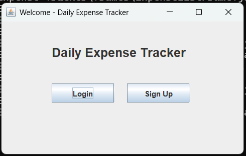

# Expense Tracker (Java Swing)

Lightweight desktop app to **track daily expenses** with a clean Swing UI and simple **file-based storage** (no database).

---

## ✨ Features
- User Sign Up & Login (file-based auth)
- Add expenses with category, amount, description, date
- Filter expense list by **category** or **date (dd-mm-yyyy)**
- Update profile (email & password)
- Simple dashboard navigation
- Data saved in `repositories/data/` (`users.txt`, `expenses.txt`, `categories.txt`)

---

## 🖥️ Run the Project

### ✅ Easiest (Windows)
1. Download ZIP → Unzip  
2. **Double-click `run_project.bat`** 🚀  
   - Compiles & launches the app automatically

### ➕ Other (cross-platform manual)
```bash
javac */*.java *.java
java Start
````

---

## 🔐 Default Login

```
User ID: 101
Password: 1234
```

---

## 📂 Project Structure (short)

```
Expense Tracker/
  Start.java
  run_project.bat
  entities/        # User, Expense, Category
  frames/          # Entry, Login, SignUp, Dashboard, AddExpense, ExpenseList, UpdateProfile
  interfaces/      # Repo interfaces
  repositories/    # FileIO + repos
  repositories/data/
    users.txt
    expenses.txt
    categories.txt
```

---

## 📸 Screenshots

### Welcome


`Signin-Signup.png`

### Login


`Screenshot 2025-10-01 004325.png`

### Sign Up


`Screenshot 2025-10-01 004338.png`

### Dashboard


`Screenshot 2025-10-01 004359.png`

### Add Expense


`Screenshot 2025-10-01 004437.png`

### Expense Added


`Screenshot 2025-10-01 004445.png`

### Expense List


`Screenshot 2025-10-01 004504.png`

### Update Profile


`Screenshot 2025-10-01 004519.png`

---

## ⚠️ Notes

* Best on **Windows** via `.bat`; Linux/macOS use manual `javac` + `java Start`
* Plain-text storage → not for concurrent multi-user use

---

## 📄 License

All Rights Reserved (or switch to MIT if open-source).

```

---

✅ This will render each screenshot under its own heading, **with the image and filename below it**, exactly how you requested.  

Do you also want me to make a **second version with HTML resizing** (so all screenshots appear smaller and uniform in width)?
```
