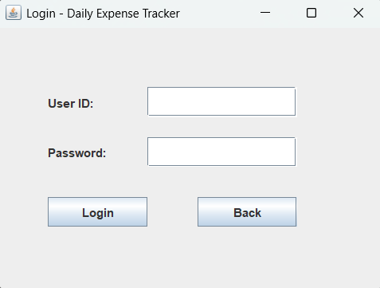
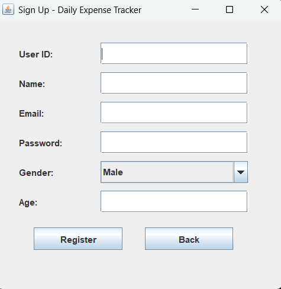
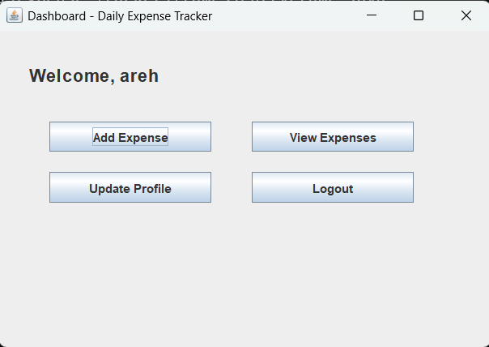
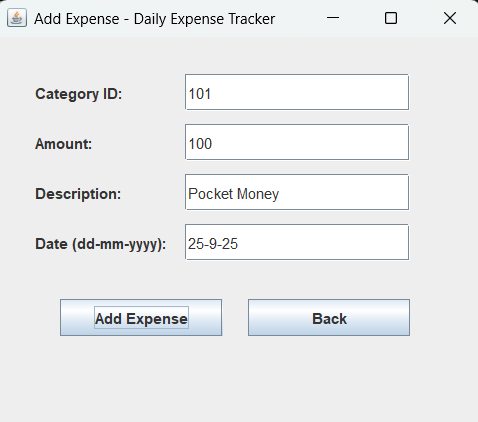
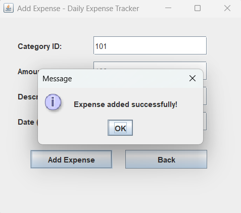
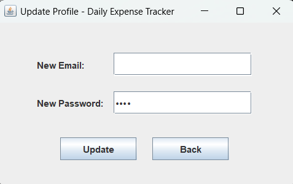

# 💰 Expense Tracker (Java Swing)

Lightweight desktop app to **track daily expenses** with a clean Swing UI and simple **file-based storage** (no DB).

---

## ✨ Features
- User Sign Up & Login (file-based auth)
- Add expenses with category, amount, description, date
- Filter expense list by **category** or **date (dd-mm-yyyy)**
- Update profile (email & password)
- Simple dashboard navigation
- Data saved in `repositories/data/` (`users.txt`, `expenses.txt`, `categories.txt`)

---

## 🖥️ Run the Project

### ✅ Easiest (Windows)
1) Download ZIP → Unzip  
2) **Double-click `run_project.bat`** (compiles & launches automatically)

### ➕ Other (cross-platform manual)
```bash
javac */*.java *.java
java Start
````

---

## 🔐 Default Login

```
User ID: 101
Password: 1234
```

---

## 📂 Project Structure (short)

```
Expense Tracker/
  Start.java
  run_project.bat
  entities/        # User, Expense, Category
  frames/          # Swing UI (Entry, Login, SignUp, Dashboard, AddExpense, ExpenseList, UpdateProfile)
  interfaces/      # Repo interfaces
  repositories/    # FileIO + repos
  repositories/data/
    users.txt
    expenses.txt
    categories.txt
```

---

## 📸 Screenshots

### Welcome


### Authentication




### Dashboard



### Add Expense




### Expense List


### Update Profile



---

## ⚠️ Notes

* Best on **Windows** via `.bat`; Linux/macOS use manual `javac`/`java` commands
* Plain-text storage → not for concurrent multi-user usage

---

## 📄 License

All Rights Reserved (or switch to MIT if open-source).

```

want me to swap the screenshot section to a **2-column gallery grid** (HTML) for a cleaner GitHub look?
`
